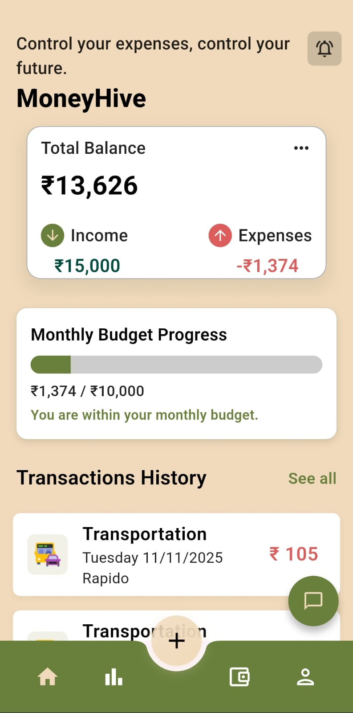
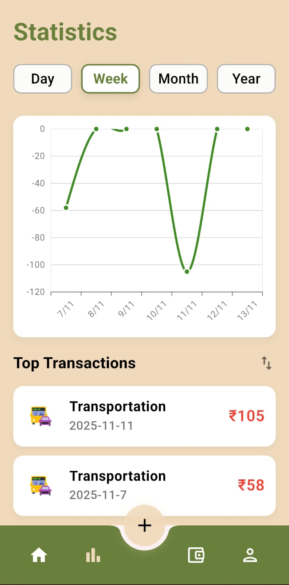
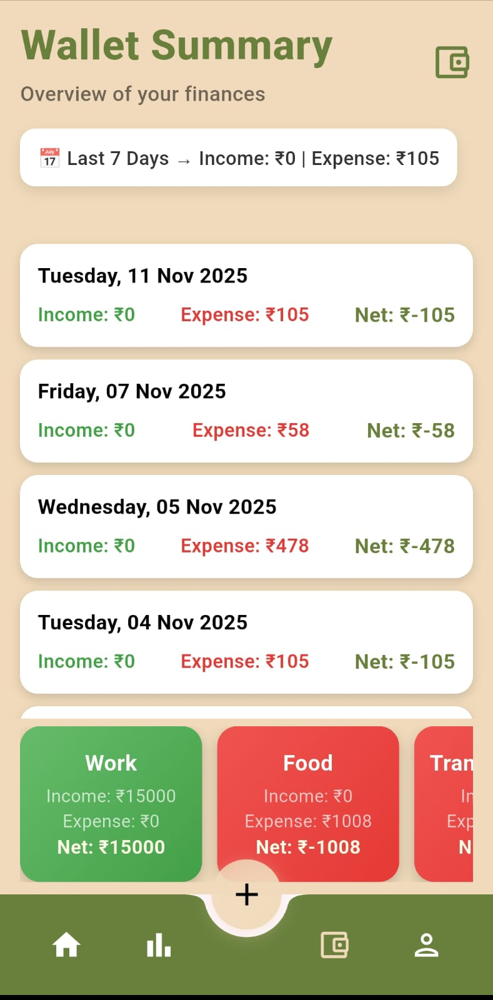
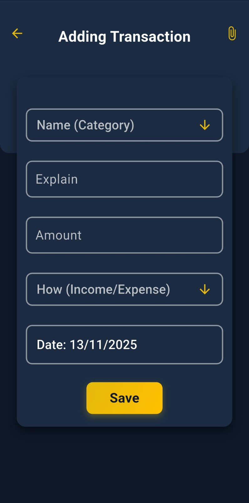
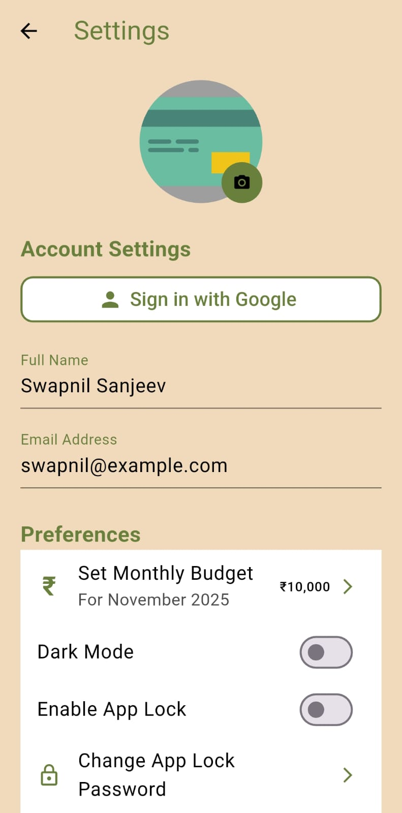
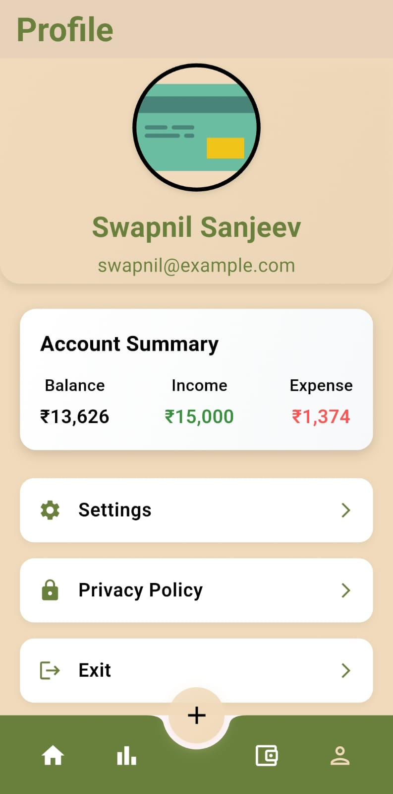

# 💰 Smart Expense Manager (Flutter)

A modern and intelligent **Flutter-based mobile application** designed to help users manage their **income and expenses** with style and efficiency.  
Smart Expense Manager comes with **AI-powered insights**, a **beautiful light and dark theme**, and **local data storage** using Hive — ensuring smooth offline performance.  

---

## 🌟 Overview

Smart Expense Manager is your **personal finance companion** that keeps track of where your money goes.  
It offers a clean, responsive interface with both **Light and Dark modes**, intuitive navigation, and a seamless user experience.  

---

## 🧩 Key Features

### 💵 Expense & Income Tracking
- Add, edit, and delete transactions instantly  
- Categorized expenses (Food, Transport, Education, etc.)  
- View total income, total expense, and available balance  

### 📊 Insights & Analytics
- Visual graphs and charts using **Syncfusion Flutter Charts**  
- Top transaction summary and budget progress tracker  

### 🌓 Dual Theme Support
- **Light Mode:** Minimal, elegant beige-gold palette for a clean look  
- **Dark Mode:** Deep navy with soft amber highlights for a modern night view  

### 🧠 Built-in AI Assistant
- Integrated **AI bot** to provide personalized financial insights and suggestions  
- Helps with queries like spending analysis, budgeting tips, etc.

### 👛 Wallet & Transaction Management
- Easily edit or delete transactions directly from the wallet screen  
- Smooth transition and instant data updates  

### 🧾 PDF Account Summary *(Under Development)*
- Planned feature for generating a downloadable PDF summary of monthly transactions  

### 🔐 Google Sign-In *(Partially Functional)*
- Authentication setup added, but full functionality is under improvement  

### 📱 Offline Support
- Works fully offline using **Hive database** — no internet required to store or view data  

---

## 🎨 App Themes Preview

### 🌞 Light Mode
<p align="center">
  
  
  
</p>

---

### 🌙 Dark Mode
<p align="center">
  
  
  
</p>

---

## ⚙️ Tech Stack

| Category | Technology |
|-----------|-------------|
| **Framework** | Flutter |
| **Language** | Dart |
| **Local Database** | Hive |
| **State Management** | Provider / setState |
| **Charts & Graphs** | Syncfusion Flutter Charts |
| **AI Integration** | Google Generative AI |
| **Authentication** | Google Sign-In |
| **File Handling** | Path Provider |
| **PDF Generation** | PDF Package *(in progress)* |
| **File Sharing** | Share Plus |

---

**Note:** AI features require a Google Gemini API key. 
   Get one free at [Google AI Studio](https://makersuite.google.com/app/apikey)
  

## 🧰 Installation & Setup

To run this project locally:

```bash
# Clone this repository
git clone https://github.com/Swapnil-Sa/Smart_Expense_Manager_Flutter.git

# Navigate into the project directory
cd Smart_Expense_Manager_Flutter

# Get dependencies
flutter pub get

# Run the app
flutter run
